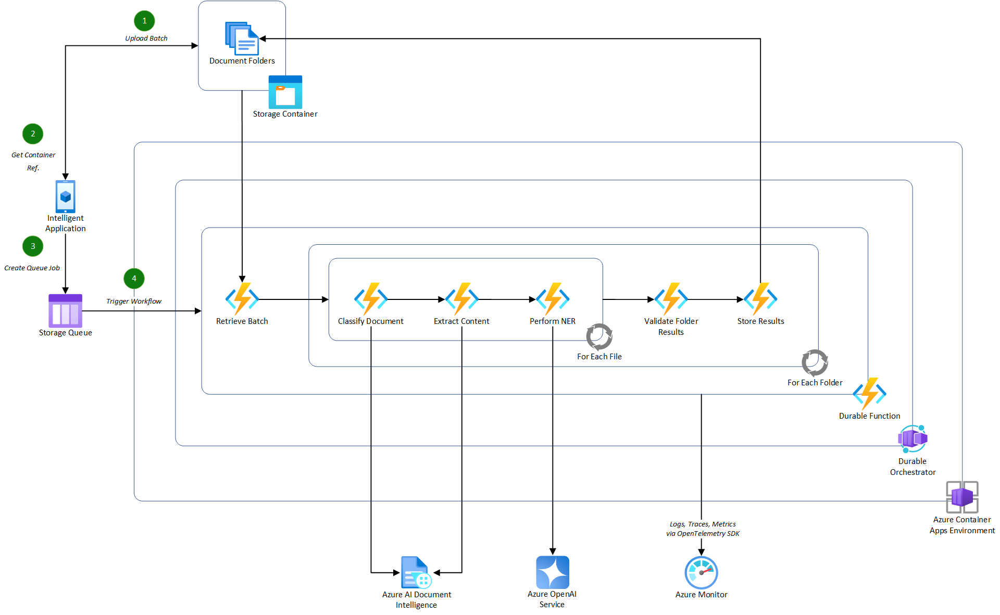

# Azure AI Document Data Extraction Pipeline using Durable Functions

This sample project demonstrates how to build a scalable, document data extraction pipeline by combining the capabilities of Durable Functions with various techniques for extraction using Azure AI services. The sample specifically processes structured invoices in PDF format. The sample can be adapted to process any structured or unstructured document format.

This approach takes advantage of the following techniques for document data extraction:

- [Using Azure AI Document Intelligence to extract Markdown content from files and perform data extraction using Azure OpenAI GPT models](https://techcommunity.microsoft.com/t5/azure-for-isv-and-startups/using-azure-ai-document-intelligence-and-azure-openai-to-extract/ba-p/4107746)
- [Using Azure OpenAI GPT-4 Omni vision capabilities to extract data from PDF files by converting them to images](https://github.com/Azure-Samples/azure-openai-gpt-4-vision-pdf-extraction-sample)

## Pre-requisites - Understanding

Before continuing with this sample, please ensure that you have a level of understanding of the following:

### .NET Pipeline Specific

- [Durable Functions](https://learn.microsoft.com/en-us/azure/azure-functions/durable/durable-functions-overview?tabs=in-process%2Cnodejs-v3%2Cv1-model&pivots=csharp)
- [Containers](https://learn.microsoft.com/en-us/dotnet/architecture/microservices/container-docker-introduction/)
- [Dependency Injection](https://learn.microsoft.com/en-us/dotnet/core/extensions/dependency-injection)

### Azure Services

- [Azure AI Document Intelligence](https://learn.microsoft.com/en-gb/azure/ai-services/document-intelligence/concept-layout?view=doc-intel-4.0.0&tabs=sample-code)
- [Azure OpenAI Service](https://learn.microsoft.com/en-us/azure/ai-services/openai/overview)
- [Azure Blob Storage](https://learn.microsoft.com/en-us/azure/storage/blobs/storage-blobs-introduction)
- [Azure Storage Queues](https://learn.microsoft.com/en-us/azure/storage/queues/storage-queues-introduction)
- [Azure Container Apps](https://learn.microsoft.com/en-us/azure/azure-functions/functions-deploy-container-apps?tabs=acr%2Cbash&pivots=programming-language-csharp)

## Pre-requisites - Setup

Before running the sample, you will need to have the following:

- An Azure subscription. If you don't have an Azure subscription, create a [free account](https://azure.microsoft.com/en-us/free/).
- [PowerShell Core](https://docs.microsoft.com/en-us/powershell/scripting/install/installing-powershell?view=powershell-7.1).
- [Azure CLI](https://docs.microsoft.com/en-us/cli/azure/install-azure-cli).
- [.NET 8 SDK](https://dotnet.microsoft.com/download).
- [Visual Studio](https://visualstudio.microsoft.com/) or [Visual Studio Code](https://code.visualstudio.com/).
  - If using Visual Studio Code, recommended extensions are provided in the [.vscode/extensions.json](./.vscode/extensions.json) file.
- [Azure Functions Core Tools](https://docs.microsoft.com/en-us/azure/azure-functions/functions-run-local).
- [Docker Desktop](https://www.docker.com/products/docker-desktop).
- [Azure Storage Explorer](https://azure.microsoft.com/en-us/features/storage-explorer/).

## Understanding the pipeline

The purpose of this sample is to provide a demonstration of how to effectively build stateful orchestration workflows for batch processing documents, that are stored in an Azure Storage blob container, using a queue (managed by Azure Storage queues in this example).

Below is an illustration of how the pipeline may integrate into an intelligent application consuming it in a potential real-world scenario.



> [!IMPORTANT]
> This illustration contains additional actions that are not covered in this sample project. The implementation provided focuses on the Durable Function element of the pipeline, excluding the classification of documents. For this sample project, it is assumed that all documents are invoices so classification is not required.

### Azure Components

- [**Azure Container Apps**](https://learn.microsoft.com/en-us/azure/azure-functions/functions-deploy-container-apps?tabs=acr%2Cbash&pivots=programming-language-csharp), used to host the containerized functions used in the document processing pipeline.
  - **Note**: By containerizing the functions app, you can integrate this specific orchestration pipeline into an existing microservices architecture or deploy it as a standalone service.
- [**Azure OpenAI Service**](https://learn.microsoft.com/en-us/azure/ai-services/openai/overview), a managed service for OpenAI GPT models, deploying the latest GPT-4 Omni model to support both Markdown and Vision extraction techniques.
  - **Note**: The GPT-4 Omni model is not available in all Azure OpenAI regions. For more information, see the [Azure OpenAI Service documentation](https://learn.microsoft.com/en-us/azure/ai-services/openai/concepts/models#standard-deployment-model-availability).
- [**Azure AI Document Intelligence Service**](https://learn.microsoft.com/en-gb/azure/ai-services/document-intelligence/concept-layout?view=doc-intel-4.0.0&tabs=sample-code), used to extract the content of the documents using the pre-built layout model in Markdown format.
- [**Azure Storage Account**](https://learn.microsoft.com/en-us/azure/storage/common/storage-introduction), used to store the batch of documents to be processed and the extracted data from the documents. The storage account is also used to store the queue messages for the document processing pipeline.
- [**Azure Monitor**](https://learn.microsoft.com/en-us/azure/azure-monitor/overview), used to store logs and traces from the document processing pipeline for monitoring and troubleshooting purposes.
- [**Azure Container Registry**](https://learn.microsoft.com/en-us/azure/container-registry/container-registry-intro), used to store the container images for the document processing pipeline service that will be consumed by Azure Container Apps.
- [**Azure User-Assigned Managed Identity**](https://learn.microsoft.com/en-us/entra/identity/managed-identities-azure-resources/overview-for-developers?tabs=portal%2Cdotnet), used to authenticate the service deployed in the Azure Container Apps environment to securely access other Azure services without key-based authentication, including the Azure Storage account and Azure OpenAI service.
- [**Azure Bicep**](https://learn.microsoft.com/en-us/azure/azure-resource-manager/bicep/overview?tabs=bicep), used to create a repeatable infrastructure deployment for the Azure resources.

### Project Structure

The project is structured as follows:

- **[AIDocumentPipeline](./src/AIDocumentPipeline)**: The main project containing the Durable Functions implementation for the document processing pipeline.
  - **[Invoices](./src/AIDocumentPipeline/Invoices)**: Contains the specific workflows and activities used for processing invoices.
    - Workflows are orchestrations in Durable Functions that manage the execution of activities. They are long-running and stateful.
    - Activities are the individual discrete actions that are executed by the orchestration to process the documents. State is maintained across activities by the Durable Functions runtime.
  - **[Shared](./src/AIDocumentPipeline/Shared)**: Contains specific shared components that are exclusive to the Durable Functions project, including [observability configuration](./src/AIDocumentPipeline/Shared/Observability/ObservabilityExtensions.cs) and base implementations for workflows and activities.
- **[AIDocumentPipeline.Shared](./src/AIDocumentPipeline.Shared)**: Contains reusable .NET services that can be used across multiple projects, including the document data extractor services for Azure OpenAI and Azure AI Document Intelligence.
  - **[Documents](./src/AIDocumentPipeline.Shared/Documents)**: Contains the document data extractor services for Azure OpenAI and Azure AI Document Intelligence.
    - **[DocumentIntelligence](./src/AIDocumentPipeline.Shared/Documents/DocumentIntelligence)**: Contains the service for extracting the content of the documents in Markdown using Azure AI Document Intelligence.
    - **[OpenAI](./src/AIDocumentPipeline.Shared/Documents/OpenAI)**: Contains the services for extracting the structure data from documents using Azure OpenAI. This includes both the Markdown and Vision extraction techniques.

### Flow

The sample pipeline is implemented using Durable Functions and consists of the following steps:

- Upload a batch of documents to an Azure Storage blob container.
- Once the documents are uploaded, send a message to the Azure Storage queue containing the container reference to trigger the document processing pipeline.
- The **[Process Invoice Batch workflow](./src/AIDocumentPipeline/Invoices/ProcessInvoiceBatchWorkflow.cs)** picks up the message from the queue and starts to process the request.
- Firstly, the batch document folders are retrieved from the blob container using the container reference in the message. **See [Get Invoice Folders](./src/AIDocumentPipeline/Invoices/Activities/GetInvoiceFolders.cs).**
  - _Authentication to the Azure Storage account is established via a user-assigned managed identity when deployed in Azure_.
- The initial workflow then triggers the specific invoice data extraction workflow for each document folder in the batch in parallel using the **[Extract Invoice Data workflow](./src/AIDocumentPipeline/Invoices/ExtractInvoiceDataWorkflow.cs)**. These process the folders as follows:
  - For each folder in the batch:
    - For each file in the folder:
      - Extract the content of the file using one of the registered document data extractor services, [Azure OpenAI with Markdown](./src/AIDocumentPipeline.Shared/Documents/OpenAI/OpenAIMarkdownDocumentDataExtractor.cs) or [Azure OpenAI with Vision](./src/AIDocumentPipeline.Shared/Documents/OpenAI/OpenAIVisionDocumentDataExtractor.cs). _The registration for these can be found in the [Program class](./src/AIDocumentPipeline/Program.cs) for the Azure Functions project_.
      - Extract the structured data expected for the invoice using the defined [Invoice Data object](./src/AIDocumentPipeline/Invoices/InvoiceData.cs). **See [Extract Invoice Data](./src/AIDocumentPipeline/Invoices/Activities/ExtractInvoiceData.cs).**
        - _By using a defined data-transfer object, the prompt to the language model can be strictly controlled by providing a schema of the expected data to ensure accurate extraction_.
      - Validate the extracted data based on defined business rules. **See [Validate Invoice Data](./src/AIDocumentPipeline/Invoices/Activities/ValidateInvoiceData.cs).**

### Observability

The sample project takes advantage of [OpenTelemetry](https://opentelemetry.io/) for observability, providing the ability to trace the execution of the end-to-end document processing pipeline. The observability configuration is defined in the [ObservabilityExtensions class](./src/AIDocumentPipeline/Shared/Observability/ObservabilityExtensions.cs) and is registered in the [Program class](./src/AIDocumentPipeline/Program.cs) for the Azure Functions project.

The handling of workflow to activity correlation is managed by the [base Workflow and Activity classes](./src/AIDocumentPipeline/Shared/) which are called by the specific workflow and activity implementations in the [Invoices folder](./src/AIDocumentPipeline/Invoices/).

- **See [Start Active Span in the Workflow base class](./src/AIDocumentPipeline/Shared/BaseWorkflow.cs) and [Start Active Span in the Activity base class](./src/AIDocumentPipeline/Shared/BaseActivity.cs).**

> [!NOTE]
> In this sample, the observability data is sent to Azure Monitor as the default exporter. By using OpenTelemetry, you can easily switch to other exporters if you have an existing solution in place.

## Run the sample

The sample project is designed to be deployed as a containerized application using Azure Container Apps. The deployment is defined using Azure Bicep in the [infra folder](./infra/).

The deployment is split into two parts, run by separate PowerShell scripts using the [Azure CLI](https://docs.microsoft.com/en-us/cli/azure/install-azure-cli):

- **[Core Infrastructure](./infra/main.bicep)**: Deploys all of the necessary core components that are required for the document processing pipeline, including the Azure AI services, Azure Storage account, Azure Container Registry, and Azure Container Apps environment. See [Deploy Core Infrastructure PowerShell script](./infra/Deploy-Infrastructure.ps1) for more detail on the infrastructure deployment process.
- **[Application Deployment](./infra/apps/AIDocumentPipeline/app.bicep)**: Deploys the containerized application to the Azure Container Apps environment. See [Deploy App PowerShell script](./infra/apps/AIDocumentPipeline/Deploy-App.ps1) for more detail on the containerization and deployment process.

### Setup the local environment

To setup an environment locally, simply run the [Setup-Environment.ps1](./Setup-Environment.ps1) script from the root of the project:

> [!IMPORTANT]
> Docker Desktop must be running to setup the necessary local development environment.

```powershell
.\Setup-Environment.ps1 -DeploymentName <DeploymentName> -Location <Location> -IsLocal $true -SkipInfrastructure $false
```

> [!NOTE]
> The `-IsLocal` parameter is used to determine whether the complete containerized deployment is made in Azure, or whether to deploy the necessary components to Azure that will support a local development environment. The `-SkipInfrastructure` parameter is used to skip the deployment of the core infrastructure components if they are already deployed.

When configured for local development, you will need to grant the following role-based access to your identity scoped to the specific Azure resources:

- **Azure Container Registry**:
  - **Role**: AcrPull
- **Azure Storage Account**:
  - **Role**: Storage Blob Data Contributor
  - **Role**: Storage Queue Data Contributor
- **Azure OpenAI Service**:
  - **Role**: Cognitive Services OpenAI User
- **Azure AI Document Intelligence Service**:
  - **Role**: Cognitive Services User

With the local development environment setup, you can open the solution in Visual Studio or Visual Studio Code and run the project locally.

### Setup the complete Azure environment

To setup an environment in Azure, simply run the [Setup-Environment.ps1](./Setup-Environment.ps1) script from the root of the project:

```powershell
.\Setup-Environment.ps1 -DeploymentName <DeploymentName> -Location <Location> -IsLocal $false -SkipInfrastructure $false
```

> [!NOTE]
> The `-IsLocal` parameter is used to determine whether the complete containerized deployment is made in Azure, or whether to deploy the necessary components to Azure that will support a local development environment. The `-SkipInfrastructure` parameter is used to skip the deployment of the core infrastructure components if they are already deployed.

### Running the document processing pipeline

Once an environment is setup, you can run the document processing pipeline by uploading a batch of documents to the Azure Storage blob container and sending a message to the Azure Storage queue containing the container reference.

> [!TIP]
> Use the [Azure Storage Explorer](https://azure.microsoft.com/en-us/features/storage-explorer/) to upload the batch of documents to the Azure Storage blob container and send a message to the Azure Storage queue.

A batch of invoices is provided in the tests [Invoice Batch folder](./tests/InvoiceBatch/) which can be uploaded into an Azure Storage blob container.

> [!NOTE]
> Upload all of the individual folders into the container, not the individual files. This sample processed a container that contains multiple folders, each representing a customers data to be processed which may contain one or more invoices.

Once uploaded, add the following message to the **invoices** queue in the Azure Storage account:

> [!IMPORTANT]
> When running locally, the batch must be uploaded to the deployed Azure Storage account. However, the queue message must be created in the local development storage account, Azurite, running as a Docker container. You may need to create the **invoices** queue in the local storage account first via the Azure Storage Explorer.

```json
{
  "Container": "<container-name>"
}
```


The document processing pipeline will then be triggered, processing the batch of invoices and extracting the structured data from each invoice.
